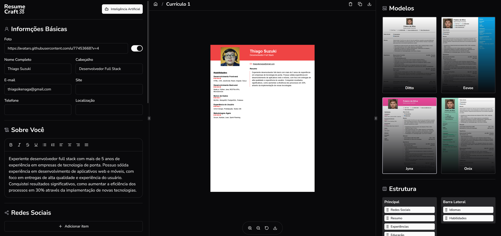

## ResumeCraft
App de Construção de Currículos com sistema de Pagamento de Créditos e geração de textos com IA

<h1 align="center">
  
</h1>

  

## 🚀 Tecnologias
- [TypeScript](https://www.typescriptlang.org/) > Linguagem Principal da Aplicação
- [NextJS](https://nextjs.org/) > Framework com React para criação do Layout 
- [TailwindCSS](https://tailwindcss.com/) > Extensão para o NextJS para estilização das páginas
- [Shadcn](https://ui-v4.shadcn.com/) > Biblioteca de Componentes para o NextJS
- [Lucide-React](https://lucide.dev/guide/packages/lucide-react) > Biblioteca de ícones
- [AuthJS](https://authjs.dev/) > Biblioteca de Autenticação
- [Axios](https://axios-http.com/) > Biblioteca de Protocolo HTTP para requisições
- [OpenAI](https://platform.openai.com/docs/overview) > IA para Geração de Textos
- [Stripe](https://stripe.com/) > Sistema de Pagamentos
- [DrizzleORM](https://orm.drizzle.team/) > ORM para Gerenciamento de Banco de Dados
- [PostgreSQL](https://www.postgresql.org/) > Servidor de Banco de Dados
- [Neon](https://neon.com/) > Ferramenta de Administração do Banco de Dados

  

## 📄 Credenciais para realização de Pagamento de Créditos (Não é preciso usar seu cartão pessoal para isso)
- Número do Cartão: 4242424242424242 (Ou qualquer outro)
- CVC: 444 (Ou qualquer outro)
- DATA: 04/34 (Ou qualquer outro)  
Referência: https://docs.stripe.com/testing?testing-method=card-numbers#visa

  

## 💻 Link Deploy
https://resume-craft-phi.vercel.app